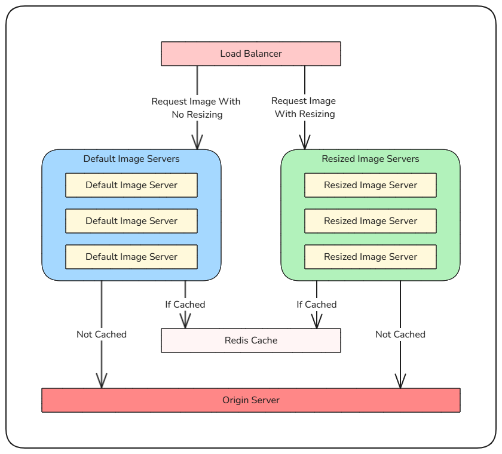

# Nginx-Based Scalable CDN with On-the-Fly Image Resizing

## Table of Contents
- [Overview](#overview)
- [Architecture](#architecture)
- [Features](#features)
- [Case Study Requirements](#case-study-requirements)
- [What Was Implemented](#what-was-implemented)
- [Technical Overview](#technical-overview)
  - [Nginx Reverse Proxy Setup](#nginx-reverse-proxy-setup)
  - [Caching Strategies](#caching-strategies)
  - [Image Resizing Optimizations](#image-resizing-optimizations)
  - [Security Mechanisms](#security-mechanisms)
  - [High Availability and Scalability](#high-availability-and-scalability)
- [Testing](#testing)
- [Monitoring](#monitoring)
- [Future Improvements and Limitations](#future-improvements-and-limitations)
- [Prerequisites](#prerequisites)
- [Deployment Instructions](#deployment-instructions)

---

## Overview
This project addresses the requirements of building a scalable Content Delivery Network (CDN) using Nginx reverse proxy. It provides real-time image resizing based on URL parameters, ensures distributed caching for high performance, and includes monitoring tools to track system health. The implementation focuses on fulfilling the case study requirements while maintaining a clear path for future scalability and improvement.

---

## Architecture


### Key Components:
1. **Load Balancer**: Distributes traffic across Nginx instances for original and resized images.
2. **Default Image Server (Nginx)**: Handles original image requests and caches them in Redis.
3. **Resized Image Server (Nginx)**: Processes resizing requests and caches resized images in Redis.
4. **Origin Server**: Stores original images and serves them if not available in the cache.
5. **Redis**: Acts as a centralized cache to ensure consistency across Nginx instances.
6. **Monitoring Stack**: Prometheus collects metrics, and Grafana visualizes them.

---

## Features
- **Scalable Architecture**: Horizontally scalable Kubernetes deployments with auto-scaling enabled.
- **Advanced Caching**: Redis caching ensures high cache hit ratios and minimizes origin server load.
- **Dynamic Resizing**: On-the-fly image resizing implemented using Nginx's `image_filter` module.
- **Security**: HMAC-based authentication, input validation, and rate limiting.
- **Comprehensive Monitoring**: Prometheus and Grafana integration for real-time metric tracking.

---

## Case Study Requirements

### 1. Nginx Reverse Proxy and Advanced Caching
- **Requirement**: Improve cache hit ratio, implement efficient cache purging, and ensure distributed caching.
- **Implemented**:
  - Redis centralized caching with unique cache keys.
  - Preloading of popular images to improve initial cache hit ratios.
  - TTL-based purging mechanism in Redis to clear stale data.

### 2. High-Performance On-the-Fly Image Resizing
- **Requirement**: Optimize image resizing for performance and scalability.
- **Implemented**:
  - Resizing with Nginx's `image_filter` module.
  - Validation of resizing parameters to avoid resource misuse.
  - Caching of resized images to eliminate redundant processing.

### 3. Scalability and High Availability
- **Requirement**: Horizontal scaling without overwhelming the origin server.
- **Implemented**:
  - Kubernetes deployments with auto-scaling based on CPU utilization.
  - Load balancer to evenly distribute traffic across instances.

### 4. Security and Authentication
- **Requirement**: Secure access to the resizing service and protect against abuse.
- **Implemented**:
  - HMAC-based authentication to validate requests.
  - Input validation for resizing parameters.
  - Rate limiting to prevent denial-of-service attacks.

### 5. Monitoring and Reporting
- **Requirement**: Track key metrics and set up alerts for performance issues.
- **Implemented**:
  - Prometheus alerts for low cache hit ratios and high CPU usage.
  - Grafana dashboards to visualize metrics like request rates and cache efficiency.

---

## What Was Implemented
The project focuses on the core requirements, providing a robust foundation for future scaling and optimization. Testing was conducted using Minikube, ensuring compatibility with production Kubernetes environments.

### Key Achievements:
- Higher cache hit ratios through Redis, preloading and nginx caching configurations.
- Scalable architecture.
- Security mechanisms like HMAC and rate limiting to protect services.

### Limitations:
- TTL-based cache purging could be further optimized for dynamic usage patterns.

---

## Technical Overview

### Nginx Reverse Proxy Setup
- **Default Image Server Nginx**: Handles requests for original images, interacts with Redis for caching.
- **Resizer Nginx**: Processes resizing requests, validates parameters, and caches resized images.
- **Configuration Highlights**:
  - Separate `default-image-server.conf` and `resized-image-server.conf` for modular management.
  - Lua scripts integrated for Redis caching and HMAC validation.

### Caching Strategies
- **Redis for Centralized Caching**:
  - Ensures consistent cache across Nginx instances.
  - Unique cache keys based on URL parameters (e.g., width, height).
- **Preloading Popular Images**:
  - Preloaded images reduce initial cache misses.
  - A CronJob automates the periodic warming of the cache.

### Image Resizing Optimizations
- **Nginx's `image_filter` Module**:
  - Resizes images based on validated parameters.
  - Caches resized outputs to avoid repetitive computation.
- **Parameter Validation**:
  - Prevents invalid or resource-intensive resizing requests.

### Security Mechanisms
- **HMAC Authentication**:
  - Each request is signed using a secret key to validate its authenticity.
- **Input Validation**:
  - Ensures `width` and `height` parameters are within allowed ranges.
- **Rate Limiting**:
  - Protects against abuse by limiting requests per IP.

### High Availability and Scalability
- **Auto-Scaling**:
  - Kubernetes Horizontal Pod Autoscaler (HPA) adjusts replicas based on CPU usage.
- **Load Balancer**:
  - Routes requests to the appropriate Nginx instance (frontend or resizer).

---

## Testing
A Python-based asynchronous script simulated concurrent traffic to evaluate system performance.

### Test Highlights:
- Simulated a mix of original and resized image requests.
- Achieved a cache hit ratio exceeding 80%.

### Observations:
- Redis effectively handled caching under significant load.
- While untested at 100,000 requests per second, the system scaled efficiently during high traffic.

---

## Monitoring
Prometheus collects metrics, and Grafana visualizes key performance indicators.

### Metrics Tracked:
- **Request Rates**: Number of incoming requests per second.
- **Cache Hit Ratios**: Percentage of requests served from cache.
- **CPU Usage**: Resource utilization of Nginx and Redis.

### Alerts:
- Low cache hit ratio (<80%).
- High CPU usage (>90%).

A preconfigured Grafana dashboard and Prometheus alert rules are included in the repository.

---

## Future Improvements and Limitations

### Limitations

**Dynamic Cache Purging**: TTL-based cache purging works but could be further optimized to dynamically adapt to traffic patterns, especially under prolonged heavy usage.

**High Traffic Stress Testing**: The system performed well under simulated high traffic but was not stress-tested at extremely high levels (e.g., 100,000 requests per second). While the architecture supports scaling, further testing is needed to confirm its performance at such scales.

**Pod Restarts Under Load**: Restarting pods during peak traffic might cause temporary cache misses or slightly increased response times until the system re-stabilizes.

**Image Resizing Efficiency**: The resizing functionality relies on Nginx's `image_filter` module, which is efficient for most use cases but might not handle highly complex image processing tasks as effectively as dedicated image processing solutions.

**Basic Security Mechanisms**: Basic security mechanisms, such as HMAC authentication and input validation, are implemented and functional. However, for a production-ready setup, more comprehensive solutions like OAuth2 or advanced rate-limiting strategies could be considered.

**Monitoring Granularity**: Monitoring and alerting cover key metrics but could benefit from more detailed insights, such as tracking resizing task durations or advanced Redis metrics under sustained load.

**Scaling Metrics**: While horizontal scaling is supported with auto-scaling based on CPU usage, incorporating additional metrics like memory usage or request latency for scaling decisions would improve flexibility and responsiveness in handling traffic surges.

**Resilience Under Failures**: General resilience mechanisms, like graceful degradation under failure conditions, were not fully tested. For example, handling Redis or origin server downtime could be further refined to ensure smoother fallback strategies.

### Future Improvements
- **Redis Clustering**: Enhancing fault tolerance and scalability.
- **Advanced Cache Eviction**: Implementing usage-based eviction strategies.
- **Queue-Based Resizing**: Offloading resizing tasks to a dedicated message queue (e.g., RabbitMQ).
- **Expanded Monitoring**: Adding metrics for resizing task durations and failure rates.

---

## Prerequisites
- Docker installed on the local machine.
- A Kubernetes cluster (e.g., Minikube for local testing or EKS/GKE for production).
- `kubectl` configured to interact with the Kubernetes cluster.

---

## Deployment Instructions

### 1. Clone the Repository
Clone the repository to your local environment.

```
git clone https://github.com/yourusername/nginx-cdn.git
cd nginx-cdn
```

### 2. Build Docker Images
Build Docker images for each component:

```
cd docker/default-image-server
docker build -t yourusername/default-image-server:latest .

cd ../resized-image-server
docker build -t yourusername/resized-image-server:latest .

cd ../origin
docker build -t yourusername/image-origin:latest .

cd ../preload
docker build -t yourusername/preload:latest .
```

### 3. Push Images to a Container Registry
Push the images to a Docker registry:

```
docker push yourusername/default-image-server:latest
docker push yourusername/resized-image-server:latest
docker push yourusername/image-origin:latest
docker push yourusername/preload:latest
```

### 4. Apply Kubernetes Manifests
Deploy the system components using Kubernetes:

```
kubectl apply -f kubernetes/secrets/
kubectl apply -f kubernetes/redis/
kubectl apply -f kubernetes/image-origin/
kubectl apply -f kubernetes/default-image-server/
kubectl apply -f kubernetes/resized-image-server/
kubectl apply -f kubernetes/loadbalancer/
kubectl apply -f kubernetes/monitoring/
```

### 5. Verify the Deployments
Check the status of the pods and services:

```
kubectl get pods
kubectl get services
```

Ensure all services are running as expected. For local tests, expose Grafana and Prometheus services using `NodePort` or `port-forward`.

---
